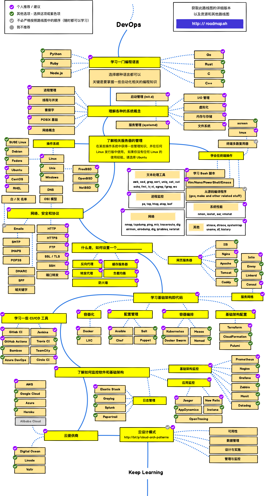

<!--
 * @Date        : 2020-05-07 18:42:27
 * @LastEditors : anlzou
 * @Github      : https://github.com/anlzou
 * @LastEditTime: 2020-05-26 23:35:24
 * @FilePath    : \blog\README.md
 * @Describe    : 
--> 
# blog（待整理）
> 使用中的包/库＆框架。

## List

> [list](./resource/anlzou-list/list.md)

## 包/框架
> ### [css](./resource/css/css.md)

> ### [js](./resource/js/JavaScript.md)

----
## 脚本
> ### [python](./resource/py/python.md)

----
## icons
> ### [icons](./resource/icons/icons.md)

----
## api
>### [java](./resource/api/java/Java.md)

----
## ui
>### [Android UI](./resource/ui/ui.md)

## [developer-roadmap](https://github.com/kamranahmedse/developer-roadmap)
> Roadmap to becoming a web developer in 2021

## Frontend Roadmap

## Backend Roadmap

## DevOps Roadmap

